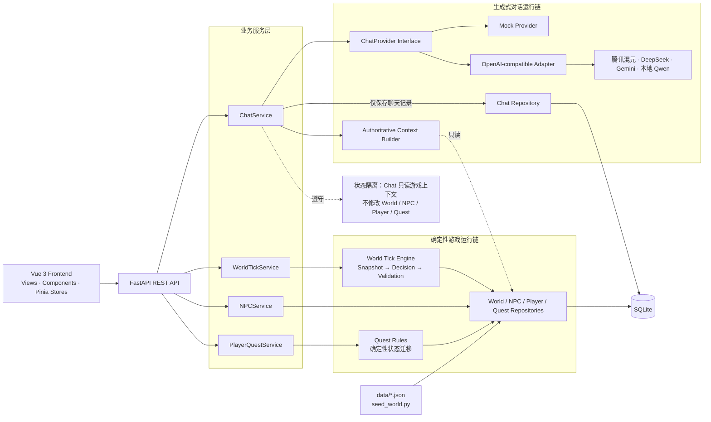

# Aleria AI Town · 曦谷

> 腾讯游戏 AI 小镇工程作业 · Phase 2 可运行版本

曦谷是一座从战争中恢复的温暖小镇。你是一名失去记忆、身带陌生印记的旅人；一次寻找失踪孩子的委托，将你带向城堡残缺的档案和森林深处的旧封锁线。

这个故事想追问：当和平建立在残缺记忆之上，寻找真相究竟是在修复世界，还是再次撕开伤口？

## 这是什么游戏

Aleria AI Town 是一个“确定性世界 + 生成式角色对话”的小型叙事 RPG 原型。玩家可以观察曦谷的时间与居民状态、在四个地点间旅行、推进世界时间、与 Ryan、Shir、Grey 对话，并完成“失踪的孩子”任务。

世界规则与 AI 表达被刻意分开：World Engine 决定时间、NPC 行动和持久化状态；Chat Provider 负责让角色说得更自然，但不能替玩家行动，也不能修改 World Tick、NPC State、Action、Event 或 Quest。

### 提交信息

| 项目 | 内容 |
| --- | --- |
| 候选人姓名 | `[提交前由候选人填写]` |
| 仓库地址 | `[提交前由候选人填写]` |
| 在线体验地址 | `N/A（Phase 3 计划）` |
| 实际开发用时 | `[提交前由候选人填写]` |
| 技术栈 | Vue 3 + TypeScript + Pinia + Phaser 3.90.0 / FastAPI + SQLAlchemy / SQLite |
| 当前阶段 | Phase 2：四场景 RPG 展示层、单地图移动与 NPC 交互 |

## 当前可以体验什么

无需 API Key，默认 Mock 模式即可体验完整闭环：

1. 从启动页创建失忆冒险者，输入名字并选择法师、游侠或牧师；首次进入可观看或跳过剧情过场。
2. 进入一张包含星辉酒馆、中央公园、晨曦城堡和低语森林入口的室外像素地图。
3. 点击 Canvas 后使用 WASD 或方向键移动；斜向速度归一化，建筑、树木和世界边界具有碰撞。
4. 点击地图上的 Ryan、Shir、Grey，复用同一套 NPC Detail 与 Chat；地图不可用时仍可通过 DOM 居民卡片进入。
5. 推进一次 World Tick，观察 Backend NPC 的语义地点变化投影到地图，而不是由 Phaser 改写世界状态。
6. 在星辉酒馆接受“失踪的孩子”委托，按 Backend objective 使用语义地点控件完成五步迁移。
7. 分别与 Ryan、Shir、Grey 对话，比较三人的立场和知识边界；当前名字和职业称谓会作为非权威上下文发送。
8. 切换真实 OpenAI-compatible 模型；上游失败时自动回退到 Mock。

任务采用六状态、五迁移的确定性状态机：

```text
available → accepted → briefed_by_grey
          → shoe_found → child_found → completed
```

每次成功交互都会写入 Quest Event 并令 `version + 1`。错误地点、跳步和过期版本都会被 Backend 拒绝。玩家旅行只修改玩家位置，不推进 World Tick；Chat 只写聊天记录，不推进任务或世界。

## 世界与角色

### 曦谷

曦谷位于艾莱瑞亚大陆的旧交通线与森林边缘。官方历史说，人类联盟约五百年前在终焉战争中击败魔王；二十多年前，附近的灰烬战争又留下旧封锁线、失踪者和残缺档案。居民共享的是公开历史，真相、传闻与个人记忆并不总是一致。

| 地点 | 稳定 ID | 当前叙事职责 |
| --- | --- | --- |
| 星辉酒馆 | `tavern` | 炉火、消息与委托汇聚处，任务起点和终点 |
| 中央公园 | `park` | 居民生活与骑士训练交错，仍能看见战争旧痕 |
| 晨曦城堡 | `castle` | Grey 守望之地，深处封存灰烬战争残缺档案 |
| 低语森林 | `forest` | 古老遗迹与林间低语交织，部分区域仍是旧封锁线 |

稳定 ID 不随显示文案演进，避免破坏数据库、API 和 Frontend Store。

### Ryan、Shir 与 Grey

- **Ryan / Knight**：热情、直率，相信骑士和英雄；父亲却因保护古族幸存者背负“叛徒”污名，使他在信仰与亲情之间摇摆。
- **Shir / Assassin**：冷静、敏锐，习惯把事实与传闻分开；她追索被删除的档案，却不确定所有真相都应该立刻公开。
- **Grey / Guardian**：克制、可靠，经历过灰烬战争的遗迹行动；他想保护来之不易的和平，也逐渐意识到沉默可能延续错误。

玩家失忆和未知印记是固定叙事起点；玩家创建时选择的名字、职业外观和称谓只描述“现在如何行动”。NPC 可以使用当前称呼、观察和提供线索，但不得把职业选择当作失忆前身份、能力或命运的证据。

## 快速启动：Mock 模式

前置环境：Python 3.11+、Node.js 20+、npm。

### 1. 启动 Backend

在仓库根目录执行：

```powershell
python -m venv .venv
.\.venv\Scripts\Activate.ps1
python -m pip install -r backend\requirements.txt
Copy-Item .env.example .env
python scripts\seed_world.py
python -m uvicorn backend.app.main:app --host 127.0.0.1 --port 8000
```

`.env.example` 默认使用 `CHAT_PROVIDER=mock`，不需要 URL、模型名或 API Key。Backend 地址为 `http://127.0.0.1:8000`，Swagger UI 为 `http://127.0.0.1:8000/docs`。

`seed_world.py` 用于可重复演示，会重置曦谷的 World、NPC、Player/Quest、Chat 和 Action/Event 数据。已有数据库需要保留状态时，应运行非破坏性的增量建表：

```powershell
python scripts\upgrade_schema.py
```

macOS/Linux 使用 `source .venv/bin/activate`，并将路径分隔符替换为 `/`。

### 2. 启动 Frontend

新开终端：

```powershell
Set-Location frontend
npm install
npm run dev -- --host 127.0.0.1
```

访问 `http://127.0.0.1:5173`。Backend 地址不同可通过 `VITE_API_BASE_URL` 配置。

## 真实 AI 与 hy-role 推荐

所有真实模型共用一个 `OpenAICompatibleChatProvider`。`ChatService` 不感知腾讯混元、Gemini、DeepSeek 或本地模型差异；供应商通过 `base_url + api_key + model + output_mode` 配置切换。

基于本项目 NPC 角色对话实测，`hy-role` 在角色一致性、上下文理解和自然表达方面表现最好，因此推荐作为本项目的首选真实模型。该结论只代表本项目场景下的体验，不构成通用模型排名。

### 推荐配置：腾讯混元 hy-role

```env
CHAT_PROVIDER=hunyuan
CHAT_LLM_BASE_URL=<TokenHub 控制台提供的 OpenAI-compatible Base URL>
CHAT_LLM_API_KEY=<仅保存在本地 Backend 的 Key>
CHAT_LLM_MODEL=hy-role
CHAT_LLM_AUTH_MODE=bearer
CHAT_LLM_OUTPUT_MODE=text
CHAT_LLM_TIMEOUT_SECONDS=30
CHAT_PROMPT_VERSION=v3
```

`hy-role` 更擅长自然角色表达，但不稳定遵守 `reply + emotion` JSON 契约，因此推荐 `text` 模式。Adapter 会验证回复长度并确定性派生 emotion，公共 Chat API、ChatService 和 Fallback 均不改变。若模型能够稳定返回结构化 JSON（如项目验证过的 `hy3`），可以改用 `CHAT_LLM_OUTPUT_MODE=structured_json`。

### 其余模型用法

#### 腾讯混元 / TokenHub：hy3

```env
CHAT_PROVIDER=hy3
CHAT_LLM_BASE_URL=<TokenHub 控制台给出的 OpenAI-compatible Base URL>
CHAT_LLM_API_KEY=<仅保存在本地 Backend 的 Key>
CHAT_LLM_MODEL=<TokenHub 控制台给出的 hy3 模型 ID>
CHAT_LLM_AUTH_MODE=bearer
CHAT_LLM_OUTPUT_MODE=structured_json
CHAT_LLM_TIMEOUT_SECONDS=30
CHAT_PROMPT_VERSION=v3
```

#### Gemini OpenAI Compatibility

```env
CHAT_PROVIDER=gemini
CHAT_LLM_BASE_URL=https://generativelanguage.googleapis.com/v1beta/openai/
CHAT_LLM_API_KEY=<仅保存在本地 Backend 的 Key>
CHAT_LLM_MODEL=gemini-3.7-flash
CHAT_LLM_AUTH_MODE=bearer
CHAT_LLM_OUTPUT_MODE=structured_json
CHAT_LLM_TIMEOUT_SECONDS=30
CHAT_PROMPT_VERSION=v3
```

修改 `.env` 后需要完整重启 Backend。

### 示意对话（非实测响应）

> 玩家：历史书可信吗？
>
> Grey：公开记录能告诉你发生过什么，却未必解释每个人为何做出选择。没有证据前，我不会把怀疑当成真相。

当前没有保存可公开引用的真实回复，因此这里明确使用示意对话，不把创作文案伪装成模型实测记录。

Primary Provider 出现超时、网络错误、非 2xx 或响应校验失败时，会自动回退到 Mock。Frontend 会显示实际 `provider` 和 `fallback_used`；安全日志只记录错误分类与 HTTP 状态，不输出敏感内容。

## 架构、接口与决策流程



### 两条明确隔离的运行链

- **确定性 World Engine**：`Snapshot → NPC Decision → Action Validation → Persistence`。所有 NPC 从同一不可变快照决策，Tick 通过 `expected_tick` 乐观锁并在单事务中持久化。
- **生成式 Chat**：`Authoritative Context → Prompt v3 → Provider → Validation → Chat Persistence`。Chat 读取 World/NPC/Quest 摘要，只保存完整 User/Assistant 轮次。

Backend 是 World、NPC、Player 和 Quest 的唯一事实来源；Frontend 不复制任务迁移规则，只展示 Backend 返回的 objective 和 available interactions。

### 当前 API

| 方法 | 路径 | 用途 |
| --- | --- | --- |
| `GET` | `/api/world` | 世界时间、四地点和 NPC 基础状态 |
| `POST` | `/api/world/tick` | 以 `expected_tick` 推进一小时 |
| `GET` | `/api/npcs/{npc_id}` | NPC 档案、状态和最近行动 |
| `POST` | `/api/npcs/{npc_id}/chat` | 首轮或续聊，返回持久化聊天轮次 |
| `GET` | `/api/player` | 玩家位置、Quest objective、版本和事件 |
| `POST` | `/api/player/travel` | 移动到稳定地点 ID，不推进 Tick |
| `POST` | `/api/quests/missing-child/interact` | 按 interaction + expected_version 推进任务 |

成功响应统一为 `{"success": true, "data": ..., "message": "ok"}`。详细契约见 [`docs/06_API_Contract.md`](docs/06_API_Contract.md)，数据库结构见 [`docs/07_Database_Schema.md`](docs/07_Database_Schema.md)。

## AI 工具使用与人工修正案例

项目采用“人定义目标与边界，AI 加速分析和实现，人工 review 后提交”的协作方式。设计先写入 Spec 和实施计划，开发按模块执行 TDD；AI 不自动 commit，也不能把模型回复直接转换为 World Action。

### 人工修正：`hy-role` 已消耗 Token，但页面仍回退到 Mock

1. **Observation**：TokenHub 显示请求已经消耗 Token，Backend 安全日志却记录 `category=response_validation`，Frontend 得到 Mock fallback。
2. **Diagnosis**：网络和鉴权已经成功；失败发生在响应解析。统一 Adapter 当时强制要求 `reply + emotion` JSON，而 `hy-role` 返回高质量自然文本。
3. **Minimal Fix**：没有复制 Hunyuan 专用 Provider，也没有修改 ChatService 或 Fallback；只在 OpenAI-compatible Adapter 增加 `structured_json | text` 输出模式。Text 模式保留长度验证，并确定性派生 emotion。
4. **Regression**：Mock、结构化 Compatible Provider、Text Provider、Fallback、Chat API 和状态隔离测试全部保留；供应商仍通过配置切换。

这个案例体现了项目的工程原则：先根据安全错误分类定位真正失败层，再在协议 Adapter 做最小修正，而不是让供应商差异渗入业务层。

## 测试、限制与路线图

### 自动验证

```powershell
# Backend
.\.venv\Scripts\python.exe -m pytest tests\backend -q -p no:cacheprovider

# Frontend
Set-Location frontend
npm test
npm run type-check
npm run build
```

自动测试使用临时 SQLite、Mock 或假 Provider，不读取 API Key，也不发起真实模型网络请求。`tests/backend/test_phase1e_acceptance.py` 会验证 Prompt v3 Mock 三人回答有区分、Chat 不修改游戏状态，以及失踪孩子五步任务完整闭环。

### 当前已完成

- Phase 0：Monorepo、FastAPI、Vue、SQLite 与首个 World API。
- Phase 1A–1B：确定性 World Tick、NPC Detail、解释层和 Frontend 闭环。
- Phase 1C：Chat Provider 抽象、Mock、Compatible Adapter、Fallback 与聊天持久化。
- Phase 1D：四地点、Player、六状态 Quest、共址检查和任务 UI。
- Phase 1E：Story Bible、Prompt v3、角色知识边界、剧情化任务文案和提交叙事。
- Phase 2：启动、创建、剧情、Town 四场景；Phaser 3.90.0 单地图、三职业外观、键盘移动、碰撞、镜头与 Backend NPC 投影。

### 已知限制

- 当前没有线上体验地址、Docker 或演示视频。
- Phaser 像素坐标只存在于当前浏览器表现层，不持久化，也不调用 travel/position API。
- 职业只影响外观、称谓和 NPC 对话上下文，没有职业数值、技能或战斗差异。
- 当前只有一张室外地图和一条确定性主线，没有室内/多地图、战斗、奖励、背包、装备、账号或分支结局。
- 尚未实现长期 Memory、Relationship、Reflection、RAG、多人系统或 LLM 驱动 World Tick。

### 后续路线

1. **Phase 2B**：界面动画、反馈、素材与多尺寸体验打磨。
2. **Phase 3**：Docker、线上部署、截图、演示视频与最终交付。
3. **Phase 3+**：更多任务、Relationship、有限 Memory 或高级 Agent。

完整内容事实源见 [`docs/15_Story_Bible_CN.md`](docs/15_Story_Bible_CN.md)，Prompt 工程见 [`docs/08_Prompt_Engineering_CN.md`](docs/08_Prompt_Engineering_CN.md)，开发路线见 [`docs/13_Development_Roadmap.md`](docs/13_Development_Roadmap.md)。
