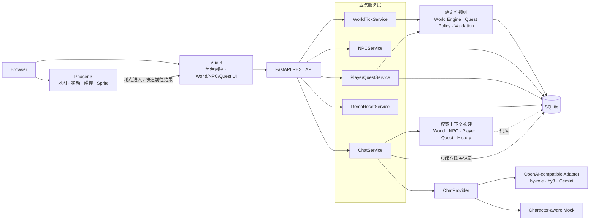

# Aleria AI Town · 曦谷

> 腾讯游戏 AI 小镇全栈开发作业 · 可在线体验的 2D 叙事 RPG Demo

曦谷是一座从战争中恢复的温暖小镇。你是一名失去记忆、身带陌生印记的旅人；一次寻找失踪孩子的委托，将你带向城堡残缺的档案和森林深处的旧封锁线。

这个故事想追问：当和平建立在残缺记忆之上，寻找真相究竟是在修复世界，还是再次撕开伤口？

**在线体验：**

线上环境当前以腾讯混元 `hy-role` 生成 NPC 对话；模型未配置、超时、网络异常或响应校验失败时会自动降级为角色化 Mock，确保主要流程仍可体验。

## 提交信息

| 项目 | 内容 |
| --- | --- |
| 候选人姓名 |  |
| 仓库地址 | <https://github.com/DavidYz1/Aleria_AI_Town> |
| 在线体验地址 |  |
| 实际开发用时 | 3.5天 |
| 技术栈 | Vue 3 + TypeScript + Pinia + Phaser 3.90.0 / FastAPI + SQLAlchemy / SQLite |
| 线上 AI | 腾讯混元 `hy-role`，失败时自动回退到 Mock |
| 部署方式 | Docker Compose + Nginx，Ubuntu 云服务器单实例部署 |

## 目录

- [90 秒体验路线](#90-秒体验路线)
- [项目定位与核心设计](#项目定位与核心设计)
- [世界观与当前章节](#世界观与当前章节)
- [NPC 设定](#npc-设定)
- [玩法与范围](#玩法与范围)
- [技术选型](#技术选型)
- [系统架构](#系统架构)
- [接口与决策流程](#接口与决策流程)
- [运行方式与端口](#运行方式与端口)
- [方法一：Docker Compose，推荐](#方法一docker-compose推荐)
- [方法二：一键启动开发环境](#方法二一键启动开发环境)
- [方法三：分别启动前后端](#方法三分别启动前后端)
- [环境变量与 AI/Mock 模式](#环境变量与-aimock-模式)
- [云服务器部署与维护](#云服务器部署与维护)
- [Demo 重置](#demo-重置)
- [AI 开发工具与人工修正案例](#ai-开发工具与人工修正案例)
- [测试、限制与文档](#测试限制与文档)

## 90 秒体验路线

1. 快速部署，从启动页开始冒险。
2. 输入玩家名字，在法师、游侠、牧师中选择职业，观看或跳过剧情过场。
3. 进入曦谷地图后，使用 WASD、方向键或地点卡片的“快速前往”移动。
4. 点击地图上的 Ryan、Shir、Grey，查看状态、最近行动并开始交流。
5. 点击“推进一回合”，观察世界时间、NPC 地点、状态与行动记录变化。
6. 前往星辉酒馆接受“失踪的孩子”，按照 Backend 返回的目标推进任务。
7. 分别询问三位 NPC 关于战争、档案或玩家印记的问题，比较他们的知识边界和立场。
8. 如需重新演示，点击“重新开始冒险”恢复初始世界并重新创建角色。

## 项目定位与核心设计

Aleria AI Town 是一个“**确定性世界模拟 + 生成式角色对话**”的小型叙事 RPG。它不是让大模型决定游戏规则，而是让大模型在明确的世界规则、角色知识和任务上下文内扮演 NPC。

### 核心原则

1. **Backend 是唯一事实来源**：World、NPC、玩家语义地点和 Quest 状态均由 FastAPI 与 SQLite 维护。
2. **Phaser 负责游戏表现**：地图、碰撞、移动、镜头与 Sprite 由 Phaser 管理，但 Phaser 不独立完成任务状态迁移。
3. **键盘与点击移动归一**：WASD 进入地点区域和“快速前往”最终都会同步到同一个 Backend 地点状态，避免输入设备限制阻断任务。
4. **AI 只负责表达**：模型可以决定 NPC 如何说，但不能擅自推进 Tick、移动 NPC、完成任务或写入世界状态。
5. **确定性规则优先**：World Tick、行为校验和 Quest 状态机均使用可测试、可复现的普通业务逻辑。
6. **可降级、可重置**：模型失败时回退 Mock；地图不可用时保留 DOM 交互入口；Demo 可以恢复到初始状态。

## 世界观与当前章节

### 曦谷

曦谷位于艾莱瑞亚大陆的旧交通线与低语森林边缘。官方历史说，人类联盟约五百年前在终焉战争中击败魔王；二十多年前，灰烬战争又在小镇附近留下封锁线、失踪者和互相矛盾的档案。

居民共享的是公开历史，传闻、个人记忆和被保存下来的证据，这些和世界真相并不是一致的。玩家失忆和未知印记是固定的叙事起点，职业选择只表示失忆后的行事方式，不会替玩家定义失忆前的身份或命运。

| 地点 | 稳定 ID | 叙事职责 |
| --- | --- | --- |
| 星辉酒馆 | `tavern` | 炉火、消息与委托汇聚处，也是当前任务起点和终点 |
| 中央公园 | `park` | 居民生活与骑士训练交错，表现曦谷正在恢复的日常 |
| 晨曦城堡 | `castle` | Grey 守望和档案保管之地，记录并不等于完整真相 |
| 低语森林 | `forest` | 古老遗迹与灰烬战争旧封锁线交叠，长期谜团首次浮现 |

地点 ID 不随显示文案变化，避免叙事文案演进破坏数据库、API 和 Frontend Store。

### 当前章节：失踪的孩子

玩家在星辉酒馆接受委托，向 Grey 询问线索，进入低语森林旧封锁线寻找鞋子和失踪的孩子，再把孩子安全带回酒馆。这个任务首先是一件具体而温暖的救援，同时留下三个长期问题：

- 为什么封锁线附近出现了与玩家相似的印记？
- 孩子听见的低语来自什么？
- Grey 是否曾在灰烬战争中见过相同符号？

README 只介绍玩家可知的 Public Lore，不公开完整幕后真相。含剧透的内容事实源见 [`docs/15_Story_Bible_CN.md`](docs/15_Story_Bible_CN.md)。

## NPC 设定

三位 NPC 不只是更换名称和 Prompt。他们对同一段历史拥有不同知识、欲望和错误认知，构成“**相信—追问—沉默**”的认知三角。

| NPC | 表面性格 | 内在矛盾与反差 | 对真相的态度 | 对话特点 |
| --- | --- | --- | --- | --- |
| **Ryan / Knight** | 热情、直接、乐观，渴望成为真正的骑士 | 崇尚英雄主义，却背负父亲“叛徒”的污名；努力表现勇敢，却不愿承认自己害怕史莱姆 | 相信过去存在真正的英雄，希望父亲只是被误解 | 短句、坦率、有行动感；紧张时会故作镇定 |
| **Shir / Assassin** | 冷静、敏锐、克制，熟悉森林和隐秘行动 | 把真相视作对抗权力的武器，却担心未经准备的公开会伤害无辜；冷淡外表下藏着对甜食的偏爱 | 质疑官方记录，持续寻找被删除的证据 | 精确、试探性强，经常用反问和细节观察对方 |
| **Grey / Guardian** | 沉稳、可靠、谨慎，是灰烬战争老兵 | 为保护小镇而保持沉默，却逐渐意识到沉默也在延续错误 | 知道部分记录互相矛盾，但不愿轻易公开危险碎片 | 言辞简洁、有分量，先确认事实和风险，很少下绝对结论 |

### 关系与知识边界

- **Ryan 相信**英雄故事，但无法调和骑士信仰与父亲的污名。
- **Shir 追问**故事为何出现缺口，但并不知道完整的 Author Truth。
- **Grey 知道碎片却沉默**，因为他既见过历史被隐瞒，也见过遗迹力量造成真实死亡。
- 三人都不知道玩家失忆前的身份，也不能仅凭印记替玩家补全过去。
- Chat Prompt 只提供角色应该知道的内容，不把完整世界真相直接塞给 NPC。

## 玩法与范围

### 当前可体验内容

- 启动页、失忆冒险者创建、剧情过场、2D RPG 小镇四个场景。
- 玩家取名和法师、游侠、牧师三选一；选择保存在浏览器 `localStorage`。
- 职业影响外观、称谓和 NPC 对话上下文，不增加战斗数值。
- 单张室外地图展示酒馆、公园、城堡和森林入口。
- WASD、方向键自由移动，包含碰撞、镜头跟随和地点区域识别。
- 点击地点卡片快速前往；Backend 确认语义地点后，地图角色才会移动到对应区域，失败时不会出现界面与任务状态不一致。
- 查看三位 NPC 的身份、状态、当前位置、当前行为和最近三条行动。
- 推进 World Tick，观察 NPC 基于同一世界快照做出确定性行为。
- 与 NPC 进行多轮对话；对话上下文包含当前 World、NPC、玩家称谓和 Quest 摘要。
- 完成“失踪的孩子”六状态、五迁移任务闭环。
- 重新开始冒险，恢复初始世界并清理 Demo 数据。

任务状态机：

```text
available → accepted → briefed_by_grey
          → shoe_found → child_found → completed
```

错误地点、跳步和过期版本会被 Backend 拒绝。旅行只修改玩家语义地点，不推进 World Tick；Chat 只保存聊天记录，不推进任务或世界。

### 当前不做

- 战斗、技能、背包、装备和奖励系统。
- 多张独立地图或室内地图切换。
- 账号、多人世界和复杂权限系统。
- 长期 Memory、Relationship 数值、RAG 或 LLM 驱动 World Tick。

这些边界让作业重点集中在可解释的 NPC 行为、AI 对话、状态一致性和完整体验闭环。

## 技术选型

| 层级 | 技术 | 选择原因 |
| --- | --- | --- |
| 游戏与业务前端 | Vue 3、TypeScript、Pinia、Axios | 组件化展示业务状态，类型约束清晰，便于拆分 World、Player/Quest 和 Chat Store |
| 2D 游戏层 | Phaser 3.90.0 | 已提供 Scene、Sprite、输入、碰撞、摄像机和游戏循环，适合快速实现 2D RPG |
| Backend | FastAPI、Pydantic v2 | API 契约明确、校验能力完整，并自动提供 Swagger 文档 |
| 持久化 | SQLAlchemy、SQLite | 单文件、低运维成本，满足单实例作业 Demo 的世界状态与聊天持久化 |
| AI 接入 | OpenAI-compatible Adapter | 通过配置复用腾讯混元、Gemini 等兼容服务，业务层不依赖具体供应商 |
| 部署 | Docker Compose、Nginx | 保持 Frontend + Backend 当前架构，支持环境隔离、健康检查和服务器迁移 |

### 为什么选择 Phaser，而不是直接使用 PixiJS

PixiJS 更接近高性能 2D 渲染引擎，场景管理、输入系统和游戏循环需要自行组织。Phaser 在渲染之上直接提供轻量游戏框架能力，更符合本项目的 RPG 场景和开发周期。项目仍由 Vue 负责业务界面，Phaser 只负责地图与游戏表现，避免把整个 Web 应用塞进游戏 Canvas。

## 系统架构



架构中有两条明确隔离的运行链：

- **确定性游戏链**：`Snapshot → Decision → Validation → Transaction → New State`。
- **生成式对话链**：`Authoritative Context → Prompt v3 → Provider → Validation → Chat Persistence`。

AI 对话不能进入 Action Execution、Quest Transition 或 World Update。

## 接口与决策流程

成功响应统一为：

```json
{
  "success": true,
  "data": {},
  "message": "ok"
}
```

### 主要接口

| 方法 | 路径 | 用途 | 关键校验或失败行为 |
| --- | --- | --- | --- |
| `GET` | `/api/health` | 检查 API、数据库和当前 Chat Provider | 数据库不可用返回 `503` |
| `GET` | `/api/world` | 获取时间、地点与 NPC 基础状态 | 世界不存在或数据库异常时返回错误响应 |
| `POST` | `/api/world/tick` | 以 `expected_tick` 推进一个世界回合 | 过期 Tick 返回 `409`，事务失败返回 `503` |
| `GET` | `/api/npcs/{npc_id}` | 获取 NPC 档案、状态与最近行动 | NPC 不存在返回 `404` |
| `POST` | `/api/npcs/{npc_id}/chat` | 创建或继续 NPC 多轮对话 | 校验 NPC、conversation、输入与模型输出；Primary 失败自动尝试 Mock |
| `GET` | `/api/player` | 获取玩家地点、Quest objective、版本与事件 | 玩家或任务不存在返回 `404` |
| `POST` | `/api/player/travel` | 更新玩家权威语义地点，不推进 Tick | 只接受稳定地点 ID；未知地点返回 `404` |
| `POST` | `/api/quests/missing-child/interact` | 按 interaction 与 `expected_version` 推进任务 | 错误地点、跳步或版本冲突返回 `409` |
| `POST` | `/api/demo/reset` | 恢复 Demo 初始数据 | 在单事务中重建种子状态，失败返回 `503` |

完整请求与响应字段见 [`docs/06_API_Contract.md`](docs/06_API_Contract.md)，数据库结构见 [`docs/07_Database_Schema.md`](docs/07_Database_Schema.md)。

### World Tick 决策流程

```text
Frontend 提交 expected_tick
    ↓
Backend 校验乐观锁版本
    ↓
创建本回合不可变 World Snapshot
    ↓
每个 NPC 根据角色、地点、状态、时间和允许行为选择下一步
    ↓
Action / Target Validation
    ↓
同一数据库事务保存 World、NPC、Action 与 Event
    ↓
返回新的权威世界状态
```

NPC 决策不由前端写死，所有 NPC 从同一快照决策，避免先执行的 NPC 影响后执行 NPC 的本回合输入。

### NPC Chat 决策流程

```text
玩家输入
    ↓
读取权威 World / NPC / Player / Quest / History
    ↓
按 Prompt v3 注入人物性格、知识边界和当前上下文
    ↓
调用配置的 OpenAI-compatible Provider
    ↓
校验结构化 JSON 或自然文本
    ↓
成功：保存完整 User / Assistant 轮次
失败：Character-aware Mock 生成兜底回复并标记 fallback_used
```

### Quest 决策流程

```text
玩家在当前地点发起 interaction + expected_version
    ↓
Backend 校验玩家地点、任务版本、当前状态和可用交互
    ↓
MissingChildQuestPolicy 执行确定性状态迁移
    ↓
同一事务保存 Quest Progress 与 Quest Event
    ↓
返回下一 objective 和 available_interactions
```

Frontend 不复制任务迁移规则，只渲染 Backend 返回的目标与可执行交互。

## 运行方式与端口

| 运行方式 | 页面地址 | Backend / 调试地址 | 适用场景 |
| --- | --- | --- | --- |
| 线上 Demo |  | 页面同域访问 `/api` | 直接体验 |
| 本地 Docker | <http://127.0.0.1:8080/> | 页面同域访问 `/api` | 最推荐的本地复现方式 |
| 一键开发启动 | <http://127.0.0.1:5173/> | <http://127.0.0.1:8000/docs> | 日常开发 |
| 分别启动前后端 | <http://127.0.0.1:5173/> | <http://127.0.0.1:8000/docs> | 调试单个服务 |

> 本地 Docker 推荐使用 `8080`，避免 Windows 上端口 80 被占用或需要额外权限。服务器部署则使用 `80`，通过 `http://公网IP/` 访问。

## 方法一：Docker Compose，推荐

这种方式只需要 Git 和 Docker，不需要在宿主机安装 Node.js、项目 Python 依赖或 SQLite。

### Windows PowerShell

1. 安装 [Git](https://git-scm.com/download/win) 和 [Docker Desktop](https://www.docker.com/products/docker-desktop/)，启动 Docker Desktop。
2. 打开 PowerShell，执行：

```powershell
git clone https://github.com/DavidYz1/Aleria_AI_Town.git
Set-Location Aleria_AI_Town
Copy-Item .env.production.example .env.production
notepad .env.production
```

3. 在记事本中把 `HTTP_PORT=80` 改为 `HTTP_PORT=8080`。默认已经是 Mock 模式，不需要填写 API Key。保存并关闭文件，然后执行：

```powershell
docker compose --env-file .env.production up -d --build
docker compose --env-file .env.production ps
```

4. 浏览器访问 <http://127.0.0.1:8080/>。验证 Backend：

```powershell
Invoke-RestMethod http://127.0.0.1:8080/api/health
```

### Linux / macOS Bash

1. 安装 Git、Docker Engine 与 Docker Compose Plugin；macOS 也可以使用 Docker Desktop。
2. 打开终端，执行：

```bash
git clone https://github.com/DavidYz1/Aleria_AI_Town.git
cd Aleria_AI_Town
cp .env.production.example .env.production
```

3. 使用文本编辑器打开 `.env.production`，把 `HTTP_PORT=80` 改成 `HTTP_PORT=8080`，然后执行：

```bash
docker compose --env-file .env.production up -d --build
docker compose --env-file .env.production ps
curl http://127.0.0.1:8080/api/health
```

4. 浏览器访问 <http://127.0.0.1:8080/>。

### 常用 Docker 命令

Windows PowerShell 与 Bash 可以使用相同的 Compose 命令：

```bash
# 查看日志；Ctrl+C 只退出日志，不停止容器
docker compose --env-file .env.production logs -f

# 停止并移除容器，SQLite 命名卷仍然保留
docker compose --env-file .env.production down

# 再次启动
docker compose --env-file .env.production up -d

# 修改源码或依赖后重新构建
docker compose --env-file .env.production up -d --build
```

不要随意执行 `docker compose down -v`；`-v` 会删除保存 SQLite 数据的 Docker Volume。

仓库还提供 `scripts/deploy.cmd` 与 `scripts/deploy.sh` 一键部署包装器。它们会检查 Compose 配置、构建容器并等待健康检查，但宿主机需要额外安装 Python 3.11+。只安装 Docker 时，直接使用上面的 `docker compose` 命令即可。

## 方法二：一键启动开发环境

`start-dev.cmd` 和 `start-dev.sh` 会升级数据库表、仅在数据库为空时写入 Demo 种子，并同时启动 Backend 与 Frontend。它们不会自动安装 Python、Node.js 或项目依赖，所以首次运行需要先完成下面的准备。

### Windows：PowerShell + `start-dev.cmd`

1. 安装 Git、Python 3.11+、Node.js 20+。
2. 打开 PowerShell：

```powershell
git clone https://github.com/DavidYz1/Aleria_AI_Town.git
Set-Location Aleria_AI_Town

python -m venv .venv
Set-ExecutionPolicy -Scope Process Bypass
.\.venv\Scripts\Activate.ps1
python -m pip install -r backend\requirements.txt
npm --prefix frontend install
Copy-Item .env.example .env

.\scripts\start-dev.cmd
```

看到两个服务启动后访问：

- 游戏页面：<http://127.0.0.1:5173/>
- Backend Swagger：<http://127.0.0.1:8000/docs>

在启动脚本所在终端按 `Ctrl+C`，脚本会停止前后端进程。

### Linux / macOS：Bash + `start-dev.sh`

1. 安装 Git、Python 3.11+、Node.js 20+、npm。
2. 打开终端：

```bash
git clone https://github.com/DavidYz1/Aleria_AI_Town.git
cd Aleria_AI_Town

python3 -m venv .venv
source .venv/bin/activate
python -m pip install -r backend/requirements.txt
npm --prefix frontend install
cp .env.example .env

sh scripts/start-dev.sh
```

访问 <http://127.0.0.1:5173/>；Swagger 位于 <http://127.0.0.1:8000/docs>。按 `Ctrl+C` 停止两个服务。

## 方法三：分别启动前后端

这种方式最适合查看 Backend 日志、调试 API 或单独重启 Frontend。

### Windows PowerShell

首次准备：

```powershell
git clone https://github.com/DavidYz1/Aleria_AI_Town.git
Set-Location Aleria_AI_Town
python -m venv .venv
Set-ExecutionPolicy -Scope Process Bypass
.\.venv\Scripts\Activate.ps1
python -m pip install -r backend\requirements.txt
npm --prefix frontend install
Copy-Item .env.example .env
```

终端 A，启动 Backend：

```powershell
Set-Location Aleria_AI_Town
.\.venv\Scripts\Activate.ps1
python -m scripts.upgrade_schema
python -m scripts.ensure_demo_world
python -m uvicorn backend.app.main:app --host 127.0.0.1 --port 8000 --reload
```

终端 B，启动 Frontend：

```powershell
Set-Location Aleria_AI_Town\frontend
npm run dev -- --host 127.0.0.1 --port 5173
```

### Linux / macOS Bash

首次准备：

```bash
git clone https://github.com/DavidYz1/Aleria_AI_Town.git
cd Aleria_AI_Town
python3 -m venv .venv
source .venv/bin/activate
python -m pip install -r backend/requirements.txt
npm --prefix frontend install
cp .env.example .env
```

终端 A，启动 Backend：

```bash
cd Aleria_AI_Town
source .venv/bin/activate
python -m scripts.upgrade_schema
python -m scripts.ensure_demo_world
python -m uvicorn backend.app.main:app --host 127.0.0.1 --port 8000 --reload
```

终端 B，启动 Frontend：

```bash
cd Aleria_AI_Town/frontend
npm run dev -- --host 127.0.0.1 --port 5173
```

Frontend 开发模式默认请求 `http://127.0.0.1:8000`。需要使用其他 Backend 地址时，可设置 `VITE_API_BASE_URL`。

## 环境变量与 AI/Mock 模式

### 环境文件的作用

| 文件 | 用途 | 是否提交 Git |
| --- | --- | --- |
| `.env.example` | 本地开发模板，默认 Mock | 是 |
| `.env` | 本地开发实际配置 | 否 |
| `.env.production.example` | Docker/服务器部署模板，默认 Mock | 是 |
| `.env.production` | Docker/服务器实际配置，可能包含 API Key | 否 |

`compose.yaml` 中的 `${NAME:-default}` 表示：优先读取 `--env-file .env.production` 提供的值，未配置时才使用冒号后的默认值。`.env.production.example` 只是安全模板，不会被 Compose 自动当作生产密钥文件；实际部署命令显式传入 `.env.production`。

真实 API Key 只进入 Backend 容器，不会写入前端构建产物，也不会发送到浏览器。修改环境变量后需要完整重启 Backend 或重新创建容器。

以下四个配置块可以替换 `.env` 或 `.env.production` 中对应的 `CHAT_` 配置。不要在同一文件保留重复变量。

### 默认配置：Mock，无需 API Key

```env
CHAT_PROVIDER=mock
CHAT_LLM_BASE_URL=
CHAT_LLM_API_KEY=
CHAT_LLM_MODEL=
CHAT_LLM_AUTH_MODE=bearer
CHAT_LLM_OUTPUT_MODE=structured_json
CHAT_LLM_TIMEOUT_SECONDS=30
CHAT_HISTORY_LIMIT=10
CHAT_PROMPT_VERSION=v3
```

Mock 会根据 NPC、玩家输入、世界状态和 Quest 上下文返回确定性的角色化回复，而不是只返回统一的“服务不可用”。World Tick 和 Quest 在 Mock 模式下仍然完整运行。

### 推荐配置：腾讯混元 hy-role

```env
CHAT_PROVIDER=hunyuan
CHAT_LLM_BASE_URL=https://tokenhub.tencentmaas.com/v1
CHAT_LLM_API_KEY=
CHAT_LLM_MODEL=hy-role
CHAT_LLM_AUTH_MODE=bearer
CHAT_LLM_OUTPUT_MODE=text
CHAT_LLM_TIMEOUT_SECONDS=30
CHAT_HISTORY_LIMIT=10
CHAT_PROMPT_VERSION=v3
```

将 Key 填在 `CHAT_LLM_API_KEY=` 后面，不要添加引号或多余空格。`hy-role` 在当前 NPC 场景中角色表达更自然，但不稳定遵守 `reply + emotion` JSON 契约，因此推荐 `text`。Adapter 会验证正文并确定性派生 emotion。

如果 Key 留空，Backend 会安全地直接使用 Mock。

### 腾讯混元 hy3

```env
CHAT_PROVIDER=hy3
CHAT_LLM_BASE_URL=https://tokenhub.tencentmaas.com/v1
CHAT_LLM_API_KEY=
CHAT_LLM_MODEL=hy3
CHAT_LLM_AUTH_MODE=bearer
CHAT_LLM_OUTPUT_MODE=structured_json
CHAT_LLM_TIMEOUT_SECONDS=30
CHAT_HISTORY_LIMIT=10
CHAT_PROMPT_VERSION=v3
```

`hy3` 使用结构化 JSON 模式，仍复用同一个 OpenAI-compatible Adapter，不存在独立的 Hunyuan 业务分支。


### Primary Provider 与 Mock Fallback

```text
Provider 配置完整
    ↓
调用 Primary（hy-role / hy3 / Gemini）
    ├── 成功且响应合法 → 保存 Primary 回复，fallback_used=false
    └── 超时 / 网络错误 / 非 2xx / 输出非法
                          ↓
                     Mock 回复
                          ↓
                 provider=mock, fallback_used=true
```

Frontend 会显示“AI：provider”“Mock 模式”或“AI 服务异常，已使用 Mock”。`GET /api/health` 可以确认 Backend 和数据库可用，并显示当前 Provider 标签；一次对话是否真正调用成功，应以 Chat 响应中的 `provider` 与 `fallback_used` 为准。

## 云服务器部署与维护

当前线上 Demo 使用 Ubuntu、Docker Compose、Nginx 和公网 IP 的 HTTP 80 端口。下面以 Ubuntu 为例。

### 首次部署

1. 准备一台 Linux 云服务器，安装 Git、Docker Engine 和 Docker Compose Plugin。
2. 在云厂商安全组中开放 TCP 80；SSH 管理通常使用 TCP 22。
3. 连接服务器并执行：

```bash
git clone https://github.com/DavidYz1/Aleria_AI_Town.git
cd Aleria_AI_Town
cp .env.production.example .env.production
chmod 600 .env.production
nano .env.production
```

4. 至少确认下面几项：

```env
APP_ENV=production
DATABASE_URL=sqlite:////app/backend/data/aleria.db
FRONTEND_ORIGIN=http://你的公网IP
HTTP_PORT=80
```

然后从前面的 AI 配置中选择 Mock 或真实 Provider。真实 Key 只写入服务器上的 `.env.production`，不要提交 Git、发送到前端或放进截图。

5. 构建、启动并检查：

```bash
docker compose --env-file .env.production up -d --build
docker compose --env-file .env.production ps
curl http://127.0.0.1/api/health
```

最后访问 `http://你的公网IP/`。

### 更新、日志与重启

```bash
# 查看运行状态和日志
docker compose --env-file .env.production ps
docker compose --env-file .env.production logs -f --tail=200

# 拉取新代码并重新构建
git pull
docker compose --env-file .env.production up -d --build

# 普通重启
docker compose --env-file .env.production restart
```

Backend 与 Web 容器均配置 `restart: unless-stopped` 和基础健康检查。SQLite 存放在 `aleria_data` 命名卷中，重新构建容器不会清除世界数据。迁移服务器时需要保留源码、真实 `.env.production`，并单独备份或迁移该 Volume 中的数据库文件。

当前线上入口是 HTTP，不适合传输隐私数据或用于正式生产服务。API Key 不会经过浏览器，Backend 到模型服务仍使用 HTTPS；但浏览器与服务器之间的游戏请求和聊天内容没有 TLS 保护。正式对外运营应增加域名与 HTTPS，并补充认证、限流和重置权限控制。

## Demo 重置

Town 页面右上角的“重新开始冒险”会：

- 恢复初始 World 时间与 NPC 状态；
- 恢复 Player 和“失踪的孩子”任务状态；
- 清除聊天、NPC Action、World Event 和 Quest Event；
- 清除浏览器中的本地角色名字与职业；
- 销毁旧 Phaser 实例并返回角色创建流程。

Backend 接口为：

```http
POST /api/demo/reset
```

直接调用 API 只重置 Backend；通过页面按钮操作时，Frontend 还会清理 `localStorage` 并重新创建游戏实例。

这是为作业演示提供的全局重置能力。当前项目没有账号隔离，公开服务器上的访客共享同一个世界，任何访客触发重置都会影响其他访客，因此不应把该接口原样用于正式多用户产品。

## AI 开发工具与人工修正案例


### Codex + Superpowers 工作流

项目使用 **Codex** 读取仓库上下文、辅助方案分析、实现、测试、Diff 审查和部署排错，并使用 **Superpowers** 将协作过程约束为可审查的工程步骤：

```text
人工提出目标、范围和不可破坏边界
    ↓
Brainstorming：讨论方案与风险，未经确认不进入实现
    ↓
Specification / Writing Plans：把模块、接口与验收标准写清楚
    ↓
Test-Driven Development：先建立失败测试，再做最小实现
    ↓
Systematic Debugging：根据现象、日志和可验证假设定位根因
    ↓
Verification Before Completion：运行测试、类型检查、构建并检查 Diff
    ↓
人工逐模块 Review
    ↓
开发者手动提交 Git
```

Codex 不被授权自动提交 Git，也不能扩大已经确认的模块范围。人工负责：

- 决定产品范围与架构边界；
- 判断 AI 建议是否符合当前代码和作业目标；
- 审查每个模块的修改文件、测试结果和 Diff；
- 决定是否接受实现并亲自提交；
- 保护 API Key 等敏感配置。

### 人工修正案例：hy-role 已消耗 Token，但页面仍回退到 Mock

**1. 现象**

TokenHub 显示请求已经消耗 Token，但 Frontend 仍提示使用 Mock；Backend 安全日志记录 `category=response_validation`。

**2. 定位**

请求已经到达模型，说明网络和鉴权不是主要失败点。问题发生在响应解析：共享 Adapter 当时强制要求模型返回 `reply + emotion` JSON，而 `hy-role` 返回的是质量良好的自然文本。

**3. 人工判断**

没有为 Hunyuan 复制一套专用 Provider，也没有直接关闭全部响应校验。人工确认应把供应商差异限制在协议 Adapter 层，避免渗入 ChatService、API 和业务状态。

**4. 最小修正**

在统一 OpenAI-compatible Adapter 中增加 `structured_json | text` 两种输出模式。Text 模式仍验证正文长度，并根据文本确定性派生 emotion；公共 Chat API 和 Fallback 契约不变。

**5. 回归验证**

补充 Adapter、Provider、Fallback、Chat API 和状态隔离测试，重新验证：

- Mock、结构化模型和自然文本模型共用同一公共契约；
- Primary 失败后正确标记 `provider=mock` 与 `fallback_used=true`；
- Chat 不修改 World、NPC、Player 或 Quest。

这个案例体现了实际协作原则：AI 可以加速分析和实现，但最终由人根据日志证据确认失败层、选择最小架构改动并验收结果。

## 测试、限制与文档

### 自动验证

Windows PowerShell：

```powershell
# Backend
.\.venv\Scripts\python.exe -m pytest tests\backend -q -p no:cacheprovider

# Frontend
npm --prefix frontend test
npm --prefix frontend run type-check
npm --prefix frontend run build

# Docker Compose 配置（需要 Docker）
docker compose --env-file .env.production.example config --quiet
```

Linux / macOS Bash：

```bash
# Backend
.venv/bin/python -m pytest tests/backend -q -p no:cacheprovider

# Frontend
npm --prefix frontend test
npm --prefix frontend run type-check
npm --prefix frontend run build

# Docker Compose 配置（需要 Docker）
docker compose --env-file .env.production.example config --quiet
```

自动测试使用临时 SQLite、Mock 或假 Provider，不读取真实 API Key，也不发起外部模型请求。真实 Provider 验证属于显式、手动的 Smoke Test。

### 已知限制

- 当前公开部署是共享单世界、无账号的作业 Demo，不适合多人同时修改状态。
- Demo Reset 是全局接口，尚未增加认证和权限控制。
- SQLite 适合单实例部署，不支持多个 Backend 容器同时写入。
- 当前线上入口为 HTTP，没有域名和 TLS。
- Phaser 像素坐标不持久化；Backend 只保存任务需要的语义地点。
- 职业只影响外观、称谓和对话上下文，没有战斗数值差异。
- 当前只有一张室外地图和一条主线任务。
- `gemini-3.7-flash` 需要在最终提交前执行一次有真实权限的网络 Smoke Test。

### 文档导航

- [`docs/01_Assignment_Specification.md`](docs/01_Assignment_Specification.md)：腾讯作业要求整理。
- [`docs/05_Engineering_Architecture.md`](docs/05_Engineering_Architecture.md)：工程架构与边界。
- [`docs/06_API_Contract.md`](docs/06_API_Contract.md)：API 请求与响应契约。
- [`docs/07_Database_Schema.md`](docs/07_Database_Schema.md)：SQLite / SQLAlchemy 数据结构。
- [`docs/08_Prompt_Engineering_CN.md`](docs/08_Prompt_Engineering_CN.md)：Prompt 版本与角色上下文设计。
- [`docs/10_AI_Coding_Workflow.md`](docs/10_AI_Coding_Workflow.md)：AI 辅助开发与人工 Review 流程。
- [`docs/12_Game_Experience_Design.md`](docs/12_Game_Experience_Design.md)：四场景游戏体验设计。
- [`docs/15_Story_Bible_CN.md`](docs/15_Story_Bible_CN.md)：完整世界观、人物知识矩阵和连续性规则（含剧透）。

---

Aleria AI Town 的目标不是堆叠完整 RPG 系统，而是用一个可以启动、可以解释、可以测试、可以降级、可以重置和可以部署的 Demo，证明 AI 角色表达能够安全地嵌入确定性游戏世界。
