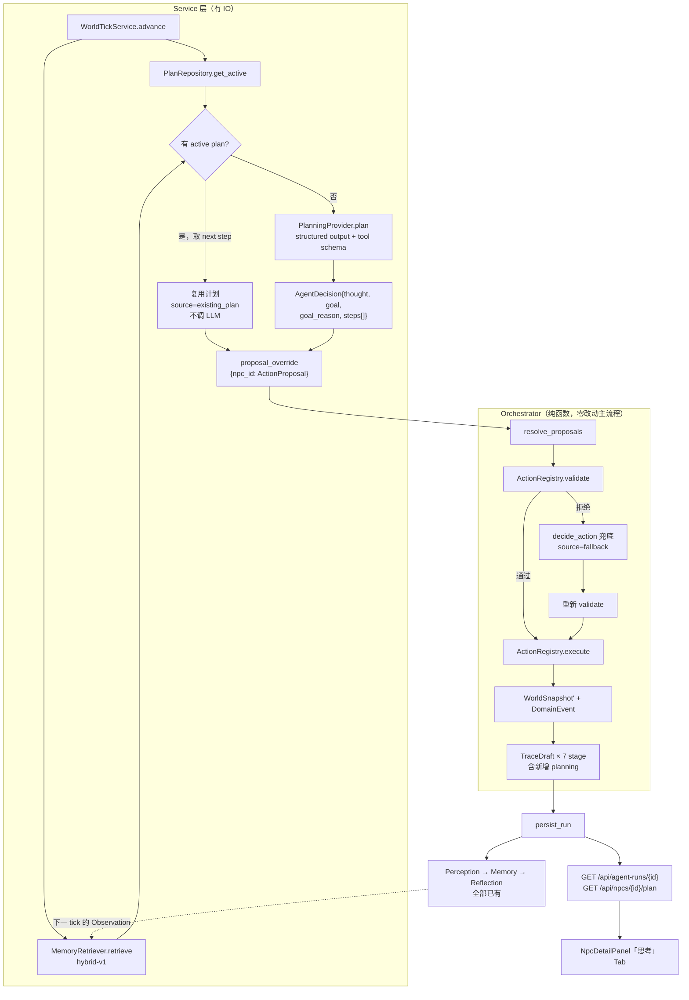

# Aleria AI Town Stage 3m：Agent Loop MVP 设计

> **状态：执行中（ACTIVE）— 2026-09-13**
> 本文档是 Stage 3 的**支线（MVP）方案**，不替代
> `docs/superpowers/specs/deferred/2026-09-13-stage-3-goals-plans-llm-actions-design-cn.md`。
> 原 Stage 3 方案已标记延期，保留为 Stage 4 演进参考。
> 交付窗口：5 个工作日（实际排期 3.95 天，余量用于 Live Provider 调试与演示打磨）。
>
> **定位声明**：本阶段目标是**可展示的 Agent MVP**，不是精简版生产 Runtime。
> 当「更严谨」与「更快看到效果」冲突时选后者，并把取舍显式记录在对应章节。
> 唯一不让步的是 §13 的不变量与 §15 的 golden 闸门 —— 前者是核心卖点，
> 后者保护已完成的 Stage 1/2 资产。

---

## 1. 决策背景：为什么是 MVP 而不是原 Stage 3

原 Stage 3 设计（25 章、43KB）是一套**生产级**方案，其核心假设是"LLM 不可靠，因此用确定性代码承担全部判断职责"。这导致：

| 维度 | 原 Stage 3 | 本 MVP（3m） |
|---|---|---|
| 目标生成 | Goal Type Registry + 候选池 + 手写仲裁算法 | LLM 一次 structured output 直出 |
| 计划 | Rolling Plan + replanning + 循环检测 | 3-4 步计划 + 5 条状态规则 |
| 新增表 | 4 张 + 双库 migration | 1 张 `agent_plans` |
| 失败处理 | §19 降级矩阵 + schema repair 重试 | 单条不变量：任何失败 → 确定性兜底 |
| 隐私上下文 | §14 独立 Deliberation Context | 复用 Stage 2 的 `RetrievalScope` |
| 交付成本 | 10-15 天 | **4-5 天** |

**判断**：原方案把"判断"写成了代码，MVP 把"判断"交给模型、把"执行与校验"留给引擎。后者才是 Agent-native 的形态，且在当前阶段的展示价值不低于前者。

**被暂缓的能力（Stage 4 再做）**：Goal Type Registry、Goal Arbitration、Rolling Plan 防循环、Schema repair 与预算、Deliberation Context 隔离、四表持久化、失败降级矩阵、五类测试策略、双推进 UI 决策。

## 2. 设计哲学

> **模型负责判断（Goal / Plan / Thought），引擎负责执行与校验（Action Registry），存储负责可解释（Trace + Plan）。**

这条边界贯穿全文，是所有取舍的依据。

## 3. 能力基线：可直接复用的资产

前两个 Stage 已经把接缝留好了 —— 以下枚举值**已在代码中定义**：

```python
ProposalSource = deterministic | existing_plan | llm | fallback     # contracts.py:70
RuntimeMode    = auto | deterministic | force_deliberation          # contracts.py:64
TRACE_STAGES   = run_started|proposal|validation|execution|event|run_completed
AgentRunDetail = {run, proposals[], events[], trace[]}              # API 已上线
```

| 能力 | 落点 | 复用方式 |
|---|---|---|
| World Engine | `world/types.py` `WorldSnapshot` | 序列化为 LLM 的环境观测 |
| Action Registry | `agents/action_registry.py:41` | **即 Tool 表**，validate/execute 已分离 |
| Orchestrator | `agents/orchestrator.py:21` | **纯函数**，新增提案注入参数即可 |
| Conflict Resolver | `agents/conflict_resolver.py:12` | LLM 与确定性提案走同一仲裁 |
| Memory 检索 | `agents/memory_retrieval.py` hybrid-v1 | 四路混合打分，直接用作 Memory Context |
| Perception | `agents/perception.py:111` | 感知层已完成，不改动 |
| Reflection | `agents/reflection.py:22` + `llm/reflection_provider.py` | **Planning Provider 直接复刻此结构** |
| Trace / Event | `schemas/agent_run.py` | UI 轨迹数据源已就绪 |
| 前端 | `NpcDetailPanel.vue`(535行) | 新增 Tab，不重写 |

**关键发现**：`run_deterministic_advance()` 是无 IO 的纯函数，`WorldTickService.advance()` 负责 IO 与持久化。因此 LLM 注入点极干净 —— **不需要重构主流程**。

## 4. 架构



**注入点设计**：保持 orchestrator 纯函数，所有 IO 上移到 Service 层。

```python
def run_advance(
    world: WorldSnapshot,
    registry: ActionRegistry = DEFAULT_ACTION_REGISTRY,
    proposal_override: Mapping[str, ActionProposal] | None = None,  # 新增
) -> AgentRuntimeResult:
    ...
    proposals = tuple(
        (proposal_override or {}).get(actor.id) or decide_action(actor, decision_world)
        for actor in decision_world.npcs
    )
```

`run_deterministic_advance` 保留为 `run_advance(world, registry)` 的别名，现有测试与调用方零改动。

## 5. 核心契约

```python
class PlanStep(BaseModel):
    action_type: Literal["move", "work", "eat", "talk", "rest", "wait"]
    target_kind: Literal["location", "npc"] | None = None
    target_id: str | None = None
    intent: str = Field(min_length=1, max_length=200)   # 人话描述，UI 展示

class AgentDecision(BaseModel):
    thought: str = Field(min_length=1, max_length=800)       # ReAct：当前推理
    goal: str = Field(min_length=1, max_length=200)          # 当前目标
    goal_reason: str = Field(min_length=1, max_length=500)   # 为什么是这个目标
    steps: tuple[PlanStep, ...] = Field(min_length=1, max_length=4)
    prompt_version: Literal["planning-v1"]
```

一次 LLM 调用同时产出：推理、目标、计划、下一步。不做两阶段调用。

**Provider 结构**（复刻 `reflection_provider.py`）：

```python
class PlanningProvider(Protocol):
    def plan(self, request: PlanningRequest) -> AgentDecision: ...

class FakePlanningProvider:      # 确定性，用于测试与离线 eval
class OpenAICompatiblePlanningProvider:   # 原生 tool calling
def build_planning_provider(settings: Settings) -> PlanningProvider:  # auto 降级
```

## 6. Plan 生命周期状态机

替代原 §11-12（Rolling Plan + 防循环），共 5 条规则：

| 触发条件 | 动作 | ProposalSource |
|---|---|---|
| 无 active plan | 调 LLM 生成新 plan | `llm` |
| 有 active plan 且未完成 | 取 `steps[current_step_index]`，**不调 LLM** | `existing_plan` |
| step 被引擎拒绝 | 确定性兜底 + plan 标记 `abandoned` | `fallback` |
| 所有 step 完成 | plan 标记 `completed`，下 tick 重新规划 | — |
| plan 存活 > 8 tick | 强制 `completed`（防卡死） | — |

"不是每 tick 都调 LLM"既是成本控制，也是 **Plan-and-Execute** 范式的体现。

## 7. Memory 四层模型

现有实现已覆盖三层，本次补齐第四层：

| 层 | 落点 | 状态 |
|---|---|---|
| **Working Memory** | `planner.build_context()` 的单 tick 上下文 | MVP 新建 |
| **Episodic Memory** | `observations` + `memories(episodic/conversation)` | ✅ 已有 |
| **Semantic Memory** | `memories(knowledge)` + `beliefs`（含 active/disputed/superseded 生命周期，即 belief revision） | ✅ 已有 |
| **Procedural Memory** | **`agent_plans`（本次新增）** + `ActionRegistry` | MVP 补齐 |

**Context 分层组装**（Context Engineering 展示点）：

```
[Identity]   role + personality + prompts/v3 角色设定
[Needs]      energy / mood / social + 阈值提示
[World]      当前位置、同场 NPC、可达地点
[Episodic]   memory_retrieval hybrid-v1 top-K（语义+词面+时近+重要度）
[Semantic]   active beliefs
[Procedural] 当前 plan 与进度
[Tools]      ActionRegistry.to_tool_manifest()
[LastOutcome] 上一步动作的执行结果（ReAct 的 Observation）
```

隐私边界复用 Stage 2 的 `RetrievalScope.INTERNAL_REFLECTION`，不新建隔离层。

## 8. MCP 风格工具体系

`ActionDefinition` 扩展两个字段，使工具**自描述**：

```python
@dataclass(frozen=True)
class ActionDefinition:
    # 现有 6 字段：action_type / required_target_kind / validation_handler
    #             / execution_handler / event_type / public_label
    description: str                        # 新增：给模型看的工具说明
    input_schema: Mapping[str, JsonValue]   # 新增：JSON Schema

class ActionRegistry:
    def to_tool_manifest(self) -> list[dict]:   # 输出 MCP tools/list 兼容格式
```

收益：
1. LLM 端可用**原生 tool calling**，而非 JSON mode 靠 prompt 约束；
2. manifest 结构即 MCP `tools/list` 响应体，接入 MCP server 只需补传输层；
3. 工具说明与校验规则在同一处定义，不会漂移。

**非目标**：本轮不实现 MCP 传输层（stdio / SSE）。

## 9. ReAct × Plan-and-Execute

tick 制世界天然构成跨 tick 的 ReAct 循环：

```
tick N   : Thought → Action
              ↓ registry.execute → DomainEvent
tick N+1 : Observation（perception → memory 自动回流，已有）→ Thought → Action
```

实现成本仅两处：`AgentDecision.thought` 字段 + context 中的 `LastOutcome` 段。

**设计立场**：Plan-and-Execute 提供长程一致性（NPC 有连贯目标），ReAct 提供单步反应性（能对世界变化即时调整）。两者在 tick 边界上结合，而非二选一。

## 10. 数据模型：`agent_plans`

```python
class AgentPlan(Base):
    __tablename__ = "agent_plans"
    id: str = String(36), PK
    world_id: str = FK("world_state.id")
    owner_npc_id: str = FK("npc_profiles.id")
    source_run_id: str | None = FK("agent_runs.id")

    thought: str            # ReAct 推理
    goal: str               # 目标
    goal_reason: str        # 目标理由
    steps_json: JSON        # list[PlanStep]
    current_step_index: int
    status: str             # active | completed | abandoned

    created_clock_tick: int
    updated_clock_tick: int
    provider: str; model: str; prompt_version: str
    latency_ms: int | None      # 可观测性：单次规划延迟
    tokens_used: int | None     # 可观测性：单次规划 token 消耗
```

约束：
- `CheckConstraint(status IN ('active','completed','abandoned'))`
- `CheckConstraint(current_step_index >= 0)`
- **partial unique index**：`(world_id, owner_npc_id) WHERE status='active'` —— 保证单 NPC 至多一条活跃计划（SQLite 与 PostgreSQL 均支持）
- `Index(world_id, owner_npc_id, status, created_clock_tick)`

Migration 走现有 alembic 流程，兼容 SQLite 与 PostgreSQL 双库。

## 11. API 演进

| 端点 | 变更 |
|---|---|
| `POST /api/world/tick` | 请求体新增可选 `runtime_mode`（auto/deterministic/force_deliberation），默认 auto |
| `GET /api/agent-runs/{run_id}` | 已存在，trace 中新增 `planning` stage 条目 |
| `GET /api/npcs/{npc_id}/plan` | **新增**：当前 active plan + 最近 N 条历史 plan |

`TRACE_STAGES` 增加 `planning` 一项，记录 thought / goal / provider / latency / token。

## 12. 前端：NpcDetailPanel「思考」Tab

在现有 `NpcDetailPanel.vue` 新增一个 Tab，展示：

- **当前 Goal** + 目标理由
- **Thought**：本 tick 的推理文本
- **Plan 进度**：步骤列表 + 已完成/当前/待执行状态标记
- **决策来源徽章**：`LLM 规划` / `沿用计划` / `确定性兜底`（对应 ProposalSource）
- **引用的 Memory**：按四层分组展示（复用 `npcMemory` store）

不新建路由页面，不重写现有面板。

## 13. 失败与降级：唯一不变量

替代原 §19 的降级矩阵，全部收敛为一条：

> **无论 LLM 超时、返回非法 schema、还是提案被 ActionRegistry 拒绝，世界一定能推进。**

实现：任一环节失败 → `decide_action()` 确定性兜底 → `source=fallback` 写入 trace → UI 显示兜底徽章。不做 schema repair 重试，不做多级降级策略。

这条不变量同时是产品卖点：LLM 不可用时系统优雅降级且对用户可见。

## 14. Agent Evaluation

`scripts/eval_agent.py`：离线跑 N tick，输出 markdown 指标表。

| 指标 | 定义 | 意义 |
|---|---|---|
| 动作合法率 | LLM 提案通过 registry 校验比例 | 模型是否理解工具约束 |
| Schema 有效率 | 结构化输出一次通过率 | 结构化输出可靠性 |
| 兜底率 | `source=fallback` 占比 | 系统韧性实际触发频率 |
| 目标达成率 | `completed` / 总 plan 数 | 规划质量 |
| 规划延迟 / token | 单次调用 p50/p95、累计 token | 成本可观测 |
| **行为熵** | 动作类型分布的香农熵 | 防"NPC 一直吃饭"的行为坍缩 |

基础设施已齐备（orchestrator 纯函数 + FakePlanningProvider），仅需写统计与报告。支持 Fake / Live 双 provider 对照跑。

## 15. 测试策略

**只测关键契约**（约占 15% 工时），其余靠端到端手动验证：

1. **Schema 边界**：`AgentDecision` 拒绝非法 `action_type`、越界 `steps` 长度、空 `thought`
2. **降级链路**：LLM 提案被 registry 拒绝 → fallback 生效 → 世界版本仍然推进、trace 记录 `source=fallback`
3. **Plan 状态机**：active → completed / abandoned / 超时强制完成 四条流转

**外加一道回归保险 —— Golden 快照**：

动手前先用现有引擎连续推进 20 tick，将 world 状态、proposals、traces 序列化为 golden 快照（`tests/backend/golden/deterministic_20tick.json`）。此后每个 Task 结束都比对一次：

> `run_deterministic_advance(world)` 的输出必须与快照**逐字节一致**。

这是 Stage 1 行为零漂移的硬证据，而非口头保证。任一 Task 导致快照不一致即视为回归，立即停止并定位。

**总量裁决：全阶段共 10 个自动化测试**（golden 1 + schema 边界 3 + Plan 状态机 3 + 降级链路 2 + partial unique index 1）。

TDD 仍是强制流程（AGENTS.md 硬规则）—— 本裁决收缩的是「测什么」，不放松「怎么测」。这 10 个测试全部走 RED → GREEN → REFACTOR。

**不做**：MCP manifest 形状测试、Repository CRUD 测试、Plan API 端点测试、Provider factory 测试、前端组件测试、Context 组装测试、Provider 集成测试、migration 双库矩阵测试、性能测试。

这些验证不是消失，而是换成更便宜的形式 —— 计划中对应 8 处手动验证步骤，每处写明「看什么、什么算对」。判据是：**错了会静默通过的用自动化测试，错了会立刻炸或肉眼可见的用手动验证**。

## 16. Task 列表与工期

| # | 任务 | 产出 | 工时 | 测试 |
|---|---|---|---|---|
| **T0** | **Golden 快照** | 20 tick 输出基线 + 比对闸门 | **0.15d** | 1 |
| T1 | 契约层 + MCP manifest | `planning_contracts.py`、`planning_provider.py`（Protocol + Fake）、`ActionDefinition` 扩展 + `to_tool_manifest()` | 0.4d | 3 |
| T2 | 数据层 | `agent_plans` 表 + migration + `plan_repository.py` | 0.4d | 1 |
| T3 | 规划层 | `agents/planner.py`：八段 Context 组装 + Plan 状态机 | 0.6d | 3 |
| T4 | Orchestrator | `run_advance(proposal_override=)` + fallback 重试 + `planning` trace stage | 0.3d | 2 |
| T5 | Service 接线 | `WorldTickService` 接入 planner + `GET /api/npcs/{id}/plan` | 0.5d | 0 |
| T6 | Live Provider | OpenAI-compatible（原生 tool calling）+ factory + auto 降级 | 0.5d | 0 |
| T7 | UI | NpcDetailPanel「思考」Tab | 0.6d | 0 |
| T8 | Eval + 演示 + 文档 | `eval_agent.py` 四项指标 + 种子剧本 + README 叙事 | 0.5d | 0 |

**合计 3.95 天**，留约 1 天缓冲应对 Live Provider 调试与演示打磨。

优先级：T0-T6 为 **P0**（Agent 自主行动闭环）；T7-T8 为 **P1**。

T0 必须最先执行 —— 它是后续所有 Task 的回归闸门。

**依赖**：T0 → {T1, T2, T6 可并行} → T3 → T4 → T5 → {T7, T8 可并行}。

## 17. 验收标准

1. 连续推进 20 tick，世界零异常，NPC 行为可追溯到 goal 与 thought；
2. 强制关闭 LLM（`runtime_mode=deterministic` 或 provider 不可用），世界仍正常推进，UI 显示兜底徽章；
3. `GET /api/npcs/{id}/plan` 返回当前目标、计划步骤与进度；
4. 「思考」Tab 能完整展示一次决策的推理链路与引用记忆；
5. `eval_agent.py` 产出 6 项指标报告；**Live provider** 下动作合法率 ≥ 90%（Fake provider 恒为 100%，不作为验收依据）；
6. 10 个关键测试全部通过（构成见 §15）；
7. **Golden 快照比对通过** —— `run_deterministic_advance` 输出与 T0 基线逐字节一致，证明 Stage 1 行为零漂移；
8. 现有全量测试套件保持通过，无新增 skip、无新增 warning。

## 18. 明确非目标

- MCP 传输层（stdio / SSE）实现
- 多 Agent 协商与消息总线
- SSE 流式推送思考过程
- 向量数据库替换（现有 hybrid retrieval 已足够）
- Goal Arbitration、Rolling Plan 防循环、Schema repair（见 deferred Stage 3）
- 测试套件清理（见 deferred test-suite-cleanup）
- 确定性回放、LLM-as-judge（候选 P2，本轮不排期）
- **Token 预算强制与限流** —— 本轮只在 `agent_plans.tokens_used` 记录消耗，不做预算约束或熔断
- **扩展动作空间** —— 保持 Stage 1 定义的 6 个动词（`move / work / eat / talk / rest / wait`）。
  NPC 的智能体现在**选择与排序**，不在可做事情的种类。新增动作会连锁改动
  `decision` / `action_registry` / 前端图标与文案，属横向铺开，对本阶段目标无实质增益。

## 19. 面试包装点

| 包装点 | 对应实现 | 话术 |
|---|---|---|
| **Agent Loop** | perception → memory → planner → registry → reflection | 完整实现 Generative Agents 的认知循环 |
| **Structured Output** | `AgentDecision` Pydantic 契约 | 用 schema 约束模型输出，非法即拒，不靠 prompt 祈祷 |
| **Tool Calling / MCP** | `ActionRegistry.to_tool_manifest()` | 工具契约与 MCP 规范对齐，模型只能调已注册工具，引擎二次校验 |
| **Context Engineering** | `planner.build_context()` 八段式 | 分层上下文 + 检索预算，不是把所有东西塞进 prompt |
| **Memory 分层** | Working / Episodic / Semantic / Procedural 四层 | 带 belief revision 的语义记忆，不是简单的向量库 |
| **Plan-and-Execute × ReAct** | Plan 状态机 + thought + LastOutcome | 长程一致性与单步反应性在 tick 边界结合 |
| **Hybrid Retrieval** | `memory_retrieval` 四路混合打分 | 语义 + 词面 + 时近 + 重要度，不是纯向量检索 |
| **Neurosymbolic** | LLM 提案 + 确定性执行 | 模型负责判断，引擎负责执行 —— AI 产品工程化的分界线 |
| **Observability** | 全链路 Trace + UI 回放 | 每一步都能回答"它为什么这么做" |
| **Agent Evaluation** | `eval_agent.py` 六项指标 | 用可量化指标评估 Agent，包括防行为坍缩的行为熵 |
| **Guardrails** | `RetrievalScope` 三档 + secrecy 分级 | NPC 不会说出它不该知道的事 |
| **韧性设计** | 单条不变量 + fallback 链路 | LLM 挂了世界照样运转 —— 这才是能上线的 AI 系统 |

最强差异化是最后一条：多数候选人的 Agent Demo 在 LLM 失败时直接崩溃，本项目会优雅降级并在 UI 上标注来源。

## 20. 后续流程

本 spec 通过 review 后，调用 `superpowers:writing-plans` 产出可执行实施计划：
`docs/superpowers/plans/2026-09-13-stage-3m-agent-loop-mvp-plan-cn.md`
